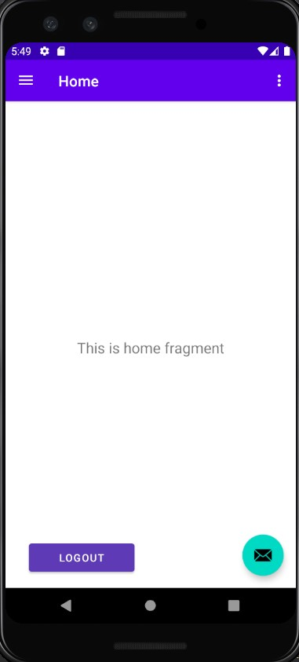

**NOTE**

## Run Backend

    cd secure-api-spring-boot
    gradle bootRun

    # then go to http://localhost:8080

## Run Android 
    
    open AndroidProject folder in Android Studio
    Run app

## Default Credentials

    email : test@mail.com
    password : password

# img

